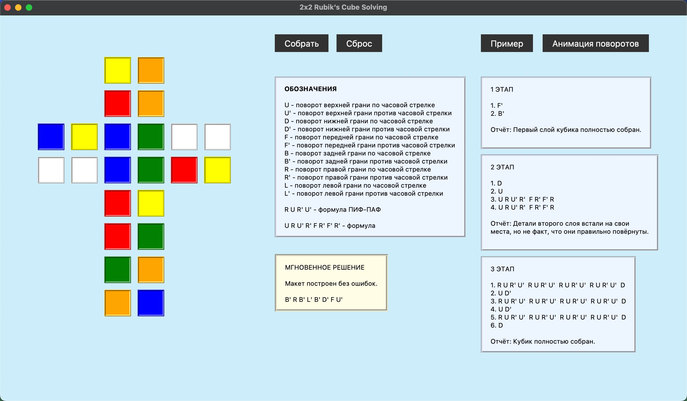

## 2x2 Rubik’s Cube Solving

Представляю вашему вниманию программу для быстрой и удобной сборки Кубика Рубика 2x2.

Решение Кубика Рубика по шагам осуществляется прямо на компьютере пользователя и обычно занимает меньше 1 минуты.

### Особенности реализации

1) **Наличие "Мгновенных решений"**  
Более 5 млн. просчитанных комбинаций, находящихся в базе данных, позволяют не дожидаться нахождения всех шагов решения. После клика на кнопку "Собрать" сразу появляется последовательность действий.

2) **Проверка введённых данных на ошибки**  
Если пользователь ошибся при построении макета разобранного кубика, программа сообщит об этом.

3) **Информативная анимация**  
После клика на кнопку "Анимация поворотов" открывается окно, в котором показаны повороты всех граней кубика в движении.

4) **Наличие примера**  
Кнопка "Пример" предоставляет вариант разобранного кубика. Ей можно воспользоваться для быстрого ознакомления с функционалом программы.

### Технологии

- **Python** - *основной язык программирования*
- **Tkinter** - *создание GUI*
- **SQLite** - *хранение и использование "Мгновенных решений"*
- **OpenCV** - *работа с видео*
- **Pillow** - *создание анимаций*

### Необходимо дополнительно скачать

Для корректного запуска Python-программы необходимо отдельно скачать и добавить в корневую папку проекта `.db-файл` базы данных (рядом с файлом `main.py`).  

**База данных - [Скачать](https://github.com/tambovnikita/2x2RubikCubeSolving/releases/download/v1.0.0/db.zip)**

### Прямые ссылки на скачивание

Помимо стандартного запуска с помощью Python (`main.py`), предусмотрены запуски на Windows (`2x2CubeSolving.exe`) и на MacOS (`2x2CubeSolving.app`/`исполняемый файл Unix`).

Windows *(.exe-файл)* - [Скачать](https://github.com/tambovnikita/2x2RubikCubeSolving/releases/download/v1.0.0/2x2RubikCubeSolving_Windows.zip)  
MacOS *(.app-файл)* - [Скачать](https://github.com/tambovnikita/2x2RubikCubeSolving/releases/download/v1.0.0/2x2RubikCubeSolving_MacOS.zip)  
MacOS *(исполняемый файл Unix)* - [Скачать](https://github.com/tambovnikita/2x2RubikCubeSolving/releases/download/v1.0.0/2x2RubikCubeSolving_Unix.zip)